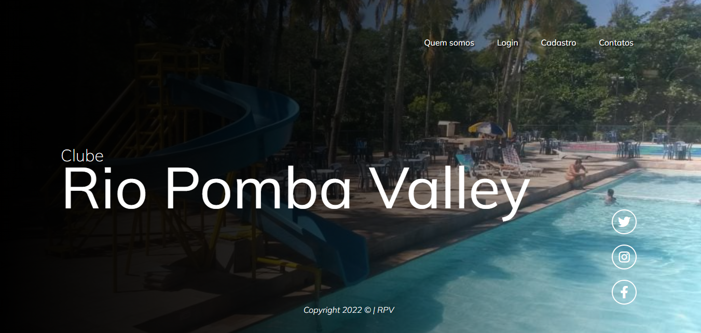
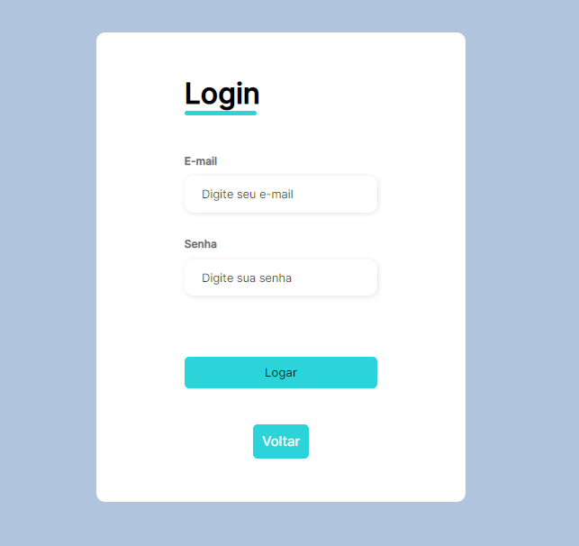
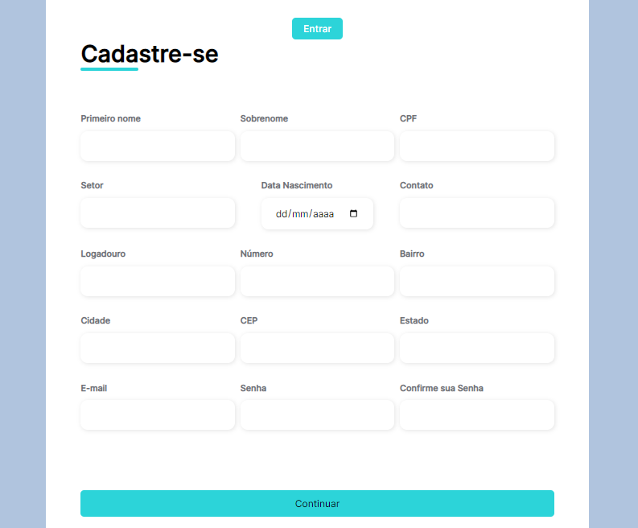
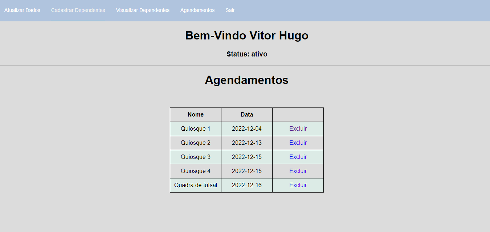
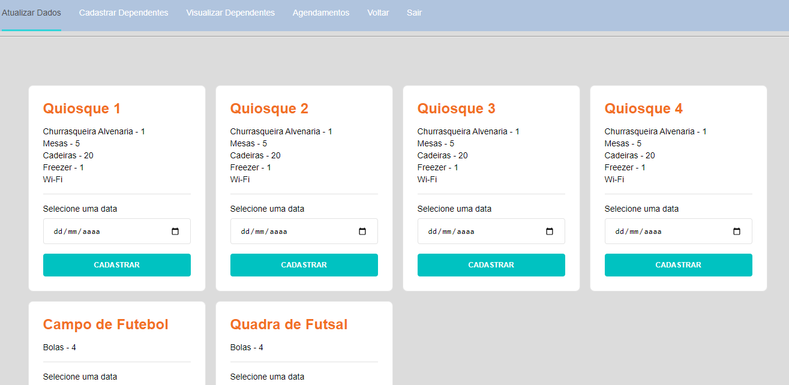
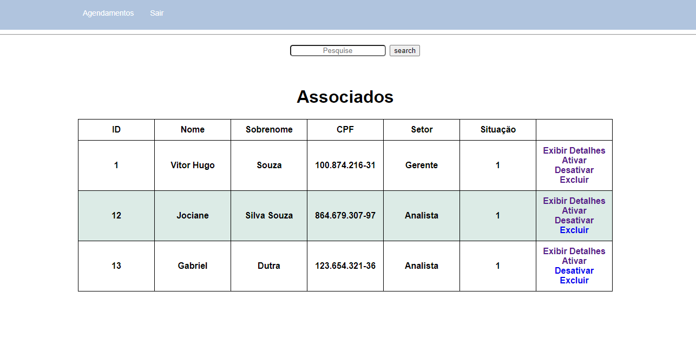
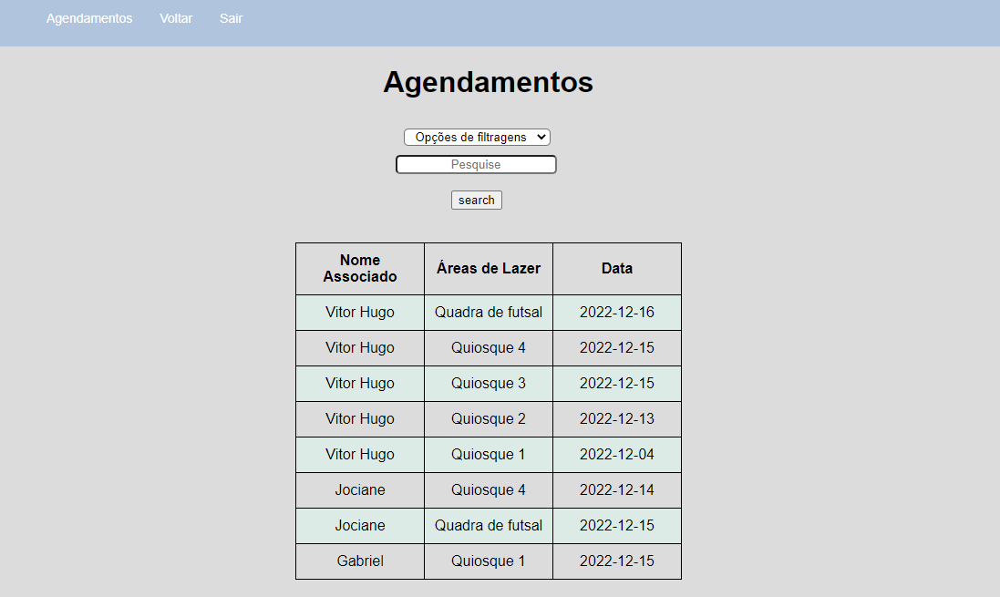

# T001BACK-END-EQUIPE3
##### Equipe: 
* ÉRICA GOMES;
* GABRIEL DUTRA;
* MAYCON LACERDA;
* VITOR HUGO SOUZA

<h1 align="center">Projeto Clube Rio Pomba Valley</h1>



#### Índice

* [Descrição do projeto](#descrição-do-projeto)
* [Status do Projeto](#status-do-projeto)
* [Instalações](#instalações)
* [Modelagem](#modelagem)
* [Funcionalidade e demonstração da aplicação](#funcionalidade-e-demonstração-da-aplicação)
* [Tecnologia utilizadas](#tecnologia-utilizadas)
* [Melhorias Futuras](#melhorias-futuras)
* [Desenvolvedores do projeto](#desenvolvedores-do-projeto)


### Descrição do projeto
O projeto desenvolvido tem por objetivo a criação de um sistema para que com eles possa manter os dados essenciais dos associados dos clubes, no qual era necessário que os seguintes elementos estivessem em pleno funcionamento:
- Cadastro de associados bem como seus dependentes;
- Agendamento das áreas do clube; 
- Tela para aprovação das solicitações de associação, no qual o administrador avaliara de acordo com os dados informados a aprovação ou não do cadastro;
-Tela de Login para os administradores e associados;
- Tela de consulta destinada aos administradores para a consulta de associados, bem como de seus dependentes cadastrados no sistema.
Para tal sistema a ser desenvolvido, foi divido em dois viés: primeiro foi realizado o desenvolvimento da modelagem de dados do problema usando o MySQL e em segundo o desenvolvimento em si, usando a plataforma VSCode.


### Status do Projeto


### Instalações
Bibliotecas que precisa está instalada para iniciar a execução do projeto.

```
npm install bcryptjs connect-flash cookie-parser
cookie-session express express-flash express-session
mysql2 sequelize nodemon session-file-store expresshandlebars nodemailer

```


### Modelagem


### Funcionalidade e demonstração da aplicação













### Tecnologia utilizadas
* [Node Js](https://nodejs.org/en/) - é um runtime, sendo um conjunto de bibliotecas responsáveis pela execução do programada, funcionando como uma interpretador de Javascript fora do ambiente do navegador web
* [Sequelize](https://sequelize.org/docs/v6/getting-started/) - é um ORM (mapeamento objeto relacional), sendo baseado em Promise para Node.js e permite os dialetos com o MySQL, para isso se cria um model que será 
o reflexo da tabela desenvolvida no banco de dados em uma classe.
* [Express-Handlebars](https://handlebarsjs.com/) - é uma template engine, com o intuito de deixar o HTML dinâmico, no qual é possível inserir variáveis back-end no front-end, este por sua vez é essencial para projetos que usam banco de dados que não são estáticos.
* [MySql](https://www.mysql.com/) - é um sistema de gerenciamento de banco de dados, que utiliza como interface a linguagem SQL
* [JavaScript](https://developer.mozilla.org/pt-BR/docs/Web/JavaScript) - linguagem de programação interpretada estruturada, de alto nível que possui tipagem dinâmica fraca e multiparadigma, sendo uma das 3 principais tecnologias
da World Wide Web.
* [Nodemailer](https://nodemailer.com/about/) - é um módulo do Node.js que tem a finalidade de realizar o envio de e-mails utilizando o JavaScript ao lado do servidor. 


### Melhorias Futuras

- [ ] Implementação de um QR Code para os associados;
- [ ] Uso de um RPA para aprovação dos requerentes da associação;
- [ ] Adicionar a opção de inserção de imagem para foto de perfil do associado;
- [ ] Melhoria na modelagem de dados e inserção de uma nova entidade para os funcionários;
- [ ] Melhorias na parte visual do sistema. ;

### Desenvolvedores do projeto
* [ÉRICA GOMES](https://www.linkedin.com/in/%C3%A9rica-fernandes-019028141/)
* [GABRIEL DUTRA](https://www.linkedin.com/in/gabriel-dutra-42014822b/)
* [MAYCON LACERDA](https://www.linkedin.com/in/maycon-lopes-76726423a/)
* [VITOR SOUZA](https://www.linkedin.com/in/vitorhugossouza/)

